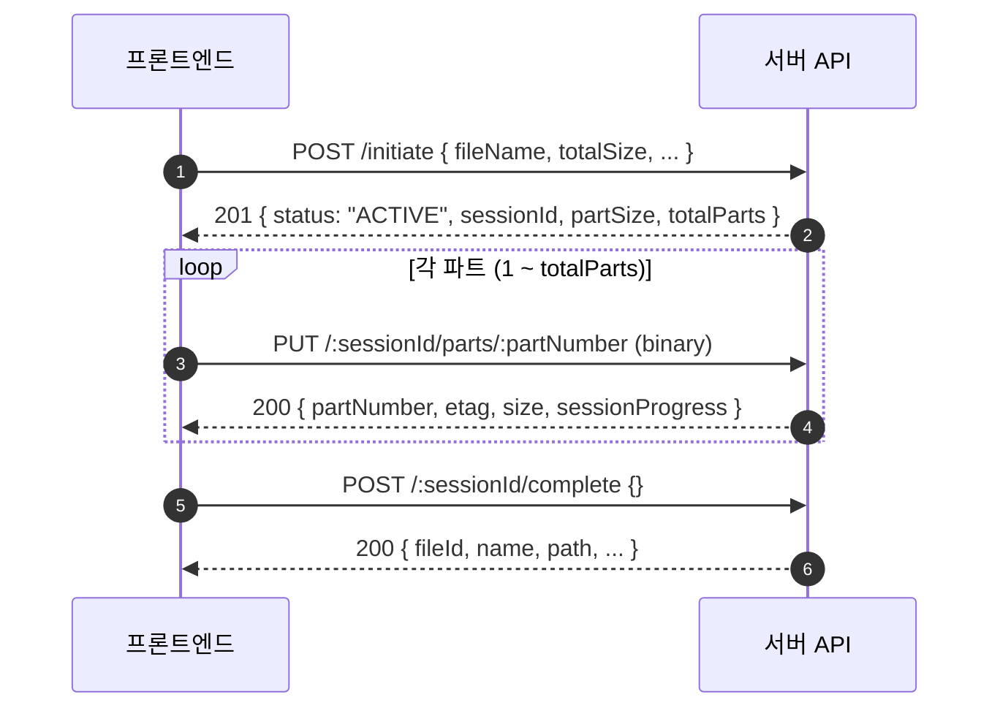
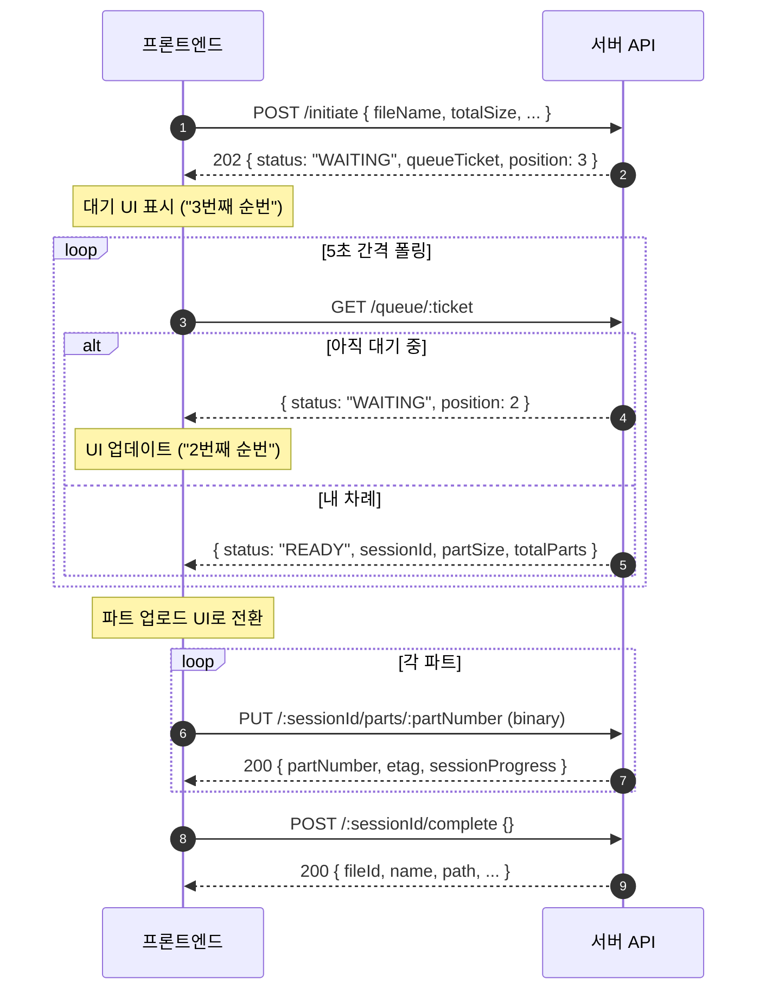
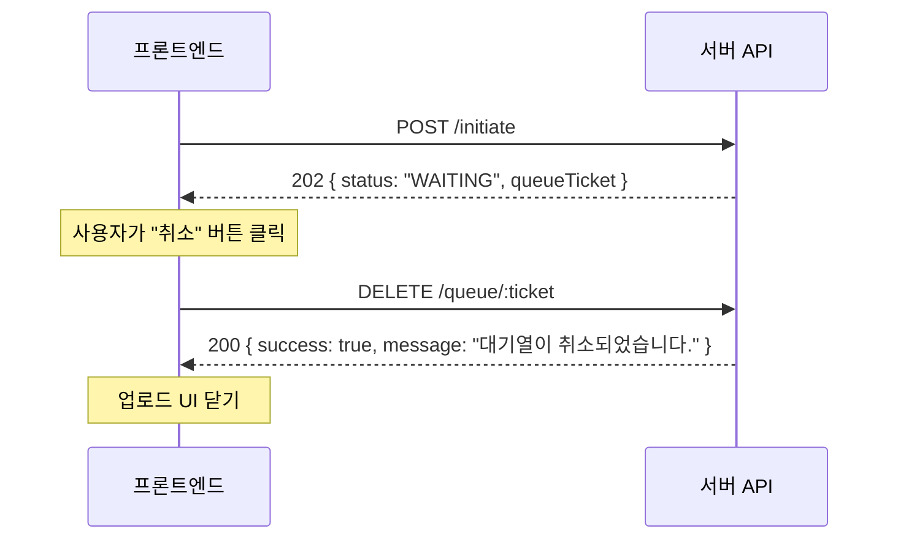

# 멀티파트 업로드 프론트엔드 통합 가이드

> 대기열(Virtual Queue) + 스트리밍 업로드가 적용된 새 멀티파트 업로드 API 통합 가이드

## 주요 변경사항 요약

| 항목 | 기존 | 변경 후 |
|------|------|---------|
| `POST /initiate` 응답 | 항상 `201` | **`201` 또는 `202`** (슬롯 여부에 따라) |
| 응답 구분 필드 | 없음 | **`status`** 필드로 구분 (`ACTIVE` / `WAITING`) |
| 대기열 | 없음 | **대기열 폴링 API** 추가 |
| 파트 업로드 | `Content-Type: application/octet-stream` | 동일 (변경 없음) |
| 파트 업로드 Body | Binary body | 동일 (변경 없음) |

> **파트 업로드(`PUT /parts/:partNumber`)와 완료(`POST /complete`) API의 요청/응답 형식은 변경 없음.**
> 프론트 변경이 필요한 부분은 **initiate 응답 분기 처리**와 **대기열 폴링** 뿐입니다.

---

## 전체 흐름도

```
사용자가 파일 선택
        │
        ▼
┌─ POST /initiate ────────────────────┐
│                                      │
│  HTTP 201 (status: "ACTIVE")    HTTP 202 (status: "WAITING")
│  → sessionId 받음                → queueTicket 받음
│  → 바로 파트 업로드 시작          → 대기열 폴링 시작
│                                      │
│                              ┌───────▼────────┐
│                              │ GET /queue/:ticket │ (5~10초 간격)
│                              │                    │
│                              │ "WAITING" → 계속 폴링
│                              │ "READY"  → sessionId 획득
│                              │ "EXPIRED"→ 재시도 or 알림
│                              └──────┬─────────┘
│                                     │
│              sessionId 획득 ◄───────┘
│                │
│                ▼
│  ┌─ 파트 업로드 (기존과 동일) ────┐
│  │ PUT /:sessionId/parts/1       │
│  │ PUT /:sessionId/parts/2       │
│  │ PUT /:sessionId/parts/3       │
│  │ ...                           │
│  └───────────────────────────────┘
│                │
│                ▼
│  POST /:sessionId/complete
│                │
│                ▼
│        업로드 완료 ✓
└──────────────────────────────────────┘
```

---

## API 상세

### Base URL

```
/v1/files/multipart
```

모든 요청에 `Authorization: Bearer <token>` 헤더 필요.

---

### 1. 업로드 초기화 (Admission Control)

```
POST /v1/files/multipart/initiate
```

#### Request Body

```json
{
  "fileName": "large_video.mp4",
  "folderId": "folder_abc123",
  "totalSize": 10737418240,
  "mimeType": "video/mp4",
  "conflictStrategy": "RENAME"
}
```

| 필드 | 타입 | 필수 | 설명 |
|------|------|------|------|
| `fileName` | string | O | 파일명 |
| `folderId` | string | O | 대상 폴더 ID (`"root"` 가능) |
| `totalSize` | number | O | 파일 전체 크기 (bytes) |
| `mimeType` | string | O | MIME 타입 |
| `conflictStrategy` | string | X | `"ERROR"` (기본) 또는 `"RENAME"` |

#### Response: 슬롯 확보 성공 (HTTP 201)

```json
{
  "status": "ACTIVE",
  "sessionId": "550e8400-e29b-41d4-a716-446655440000",
  "partSize": 10485760,
  "totalParts": 1024,
  "expiresAt": "2026-02-07T10:00:00.000Z"
}
```

→ **바로 파트 업로드를 시작합니다.**

#### Response: 슬롯 부족 → 대기열 등록 (HTTP 202)

```json
{
  "status": "WAITING",
  "queueTicket": "660e8400-e29b-41d4-a716-446655440000",
  "position": 3,
  "estimatedWaitSeconds": 900
}
```

→ **`queueTicket`을 저장하고 대기열 폴링을 시작합니다.**

#### 프론트 처리 로직

```typescript
const response = await fetch('/v1/files/multipart/initiate', {
  method: 'POST',
  headers: {
    'Content-Type': 'application/json',
    'Authorization': `Bearer ${token}`,
  },
  body: JSON.stringify({ fileName, folderId, totalSize, mimeType, conflictStrategy }),
});

const data = await response.json();

if (data.status === 'ACTIVE') {
  // ✅ 슬롯 확보 → 즉시 파트 업로드 시작
  await uploadParts(data.sessionId, data.partSize, data.totalParts);
} else if (data.status === 'WAITING') {
  // ⏳ 대기열 등록 → 폴링 시작
  showQueueUI(data.position, data.estimatedWaitSeconds);
  const sessionInfo = await pollQueueUntilReady(data.queueTicket);
  await uploadParts(sessionInfo.sessionId, sessionInfo.partSize, sessionInfo.totalParts);
}
```

---

### 2. 대기열 폴링

대기열에 등록된 경우, 클라이언트는 주기적으로 상태를 확인합니다.

```
GET /v1/files/multipart/queue/:ticket
```

#### Response 유형별

**아직 대기 중 (WAITING)**

```json
{
  "status": "WAITING",
  "position": 2,
  "estimatedWaitSeconds": 600
}
```

→ 계속 폴링. UI에 순번과 예상 대기 시간을 표시합니다.

**내 차례 → 세션 자동 생성 (READY)**

```json
{
  "status": "READY",
  "sessionId": "550e8400-e29b-41d4-a716-446655440000",
  "partSize": 10485760,
  "totalParts": 1024,
  "expiresAt": "2026-02-07T10:00:00.000Z",
  "claimDeadline": "2026-02-06T10:05:00.000Z"
}
```

→ **`sessionId`를 받아 파트 업로드를 시작합니다.**
→ `claimDeadline` 이전에 파트 업로드를 시작해야 합니다 (기본 5분).

**티켓 만료 (EXPIRED)**

```json
{
  "status": "EXPIRED",
  "message": "대기열 티켓이 만료되었습니다."
}
```

→ 사용자에게 재시도를 안내합니다.

**사용자 취소 (CANCELLED)**

```json
{
  "status": "CANCELLED",
  "message": "대기열이 취소되었습니다."
}
```

#### 폴링 구현 예시

```typescript
async function pollQueueUntilReady(
  ticket: string,
  intervalMs = 5000,
  maxAttempts = 360,  // 30분
): Promise<{ sessionId: string; partSize: number; totalParts: number }> {

  for (let i = 0; i < maxAttempts; i++) {
    const res = await fetch(`/v1/files/multipart/queue/${ticket}`, {
      headers: { 'Authorization': `Bearer ${token}` },
    });
    const data = await res.json();

    switch (data.status) {
      case 'WAITING':
        // UI 업데이트: "대기 순번 N번, 약 M분 남음"
        updateQueueUI(data.position, data.estimatedWaitSeconds);
        await sleep(intervalMs);
        break;

      case 'READY':
        // ✅ 세션 준비됨 → 파트 업로드 시작
        return {
          sessionId: data.sessionId,
          partSize: data.partSize,
          totalParts: data.totalParts,
        };

      case 'EXPIRED':
        throw new Error('대기열 티켓이 만료되었습니다. 다시 시도해주세요.');

      case 'CANCELLED':
        throw new Error('대기열이 취소되었습니다.');

      default:
        throw new Error(`알 수 없는 상태: ${data.status}`);
    }
  }

  throw new Error('대기 시간이 초과되었습니다.');
}
```

---

### 3. 대기열 취소

사용자가 대기를 취소하고 싶을 때:

```
DELETE /v1/files/multipart/queue/:ticket
```

#### Response

```json
{
  "success": true,
  "message": "대기열이 취소되었습니다."
}
```

---

### 4. 전체 대기열 현황 조회 (선택)

관리 화면이나 상태 표시 용도:

```
GET /v1/files/multipart/queue/status
```

#### Response

```json
{
  "activeSessions": 7,
  "maxActiveSessions": 10,
  "waitingCount": 3,
  "maxQueueSize": 50,
  "totalUploadBytes": 37580963840,
  "maxTotalUploadBytes": 53687091200,
  "availableSlots": 3
}
```

→ "현재 7/10 슬롯 사용 중, 3명 대기 중" 같은 정보 표시에 활용 가능.

---

### 5. 파트 업로드 (변경 없음)

```
PUT /v1/files/multipart/:sessionId/parts/:partNumber
Content-Type: application/octet-stream
Body: <binary data>
```

#### Response

```json
{
  "partNumber": 1,
  "etag": "d41d8cd98f00b204e9800998ecf8427e",
  "size": 10485760,
  "sessionProgress": 1
}
```

> 기존과 완전 동일. Body에 바이너리 데이터를 그대로 전송합니다.
> 서버 내부적으로만 Buffer 수집 → Stream 방식으로 변경되었으므로 프론트 수정 불필요.

---

### 6. 업로드 완료 (변경 없음)

```
POST /v1/files/multipart/:sessionId/complete
Content-Type: application/json
Body: {} (또는 { "parts": [...] })
```

#### Response

```json
{
  "fileId": "file_abc123",
  "name": "large_video.mp4",
  "folderId": "folder_abc123",
  "path": "/videos/large_video.mp4",
  "size": 10737418240,
  "mimeType": "video/mp4",
  "storageStatus": {
    "cache": "AVAILABLE",
    "nas": "SYNCING"
  },
  "createdAt": "2026-02-06T10:00:00.000Z",
  "syncEventId": "770e8400-e29b-41d4-a716-446655440000"
}
```

---

### 7. 세션 상태 조회 (변경 없음)

```
GET /v1/files/multipart/:sessionId/status
```

업로드 재개, 진행률 확인, 완료된 파트 목록 조회 시 사용.

---

### 8. 업로드 취소 (변경 없음)

```
DELETE /v1/files/multipart/:sessionId
```

---

## 프론트엔드 전체 구현 예시

```typescript
/**
 * 대용량 파일 멀티파트 업로드 (대기열 지원)
 */
async function multipartUpload(
  file: File,
  folderId: string,
  options?: {
    conflictStrategy?: 'ERROR' | 'RENAME';
    onProgress?: (percent: number) => void;
    onQueueUpdate?: (position: number, estimatedWait: number) => void;
    signal?: AbortSignal;
  },
) {
  const { conflictStrategy = 'ERROR', onProgress, onQueueUpdate, signal } = options ?? {};

  // ── Step 1: initiate ──
  const initRes = await fetch('/v1/files/multipart/initiate', {
    method: 'POST',
    headers: { 'Content-Type': 'application/json', 'Authorization': `Bearer ${token}` },
    body: JSON.stringify({
      fileName: file.name,
      folderId,
      totalSize: file.size,
      mimeType: file.type || 'application/octet-stream',
      conflictStrategy,
    }),
    signal,
  });
  const initData = await initRes.json();

  let sessionId: string;
  let partSize: number;
  let totalParts: number;

  if (initData.status === 'ACTIVE') {
    // 즉시 시작
    sessionId = initData.sessionId;
    partSize = initData.partSize;
    totalParts = initData.totalParts;
  } else if (initData.status === 'WAITING') {
    // ── Step 1b: 대기열 폴링 ──
    const ready = await pollQueue(initData.queueTicket, { onQueueUpdate, signal });
    sessionId = ready.sessionId;
    partSize = ready.partSize;
    totalParts = ready.totalParts;
  } else {
    throw new Error(`initiate 실패: ${JSON.stringify(initData)}`);
  }

  // ── Step 2: 파트 업로드 ──
  const CONCURRENCY = 3; // 동시 업로드 파트 수
  let completedParts = 0;

  async function uploadPart(partNumber: number) {
    const start = (partNumber - 1) * partSize;
    const end = Math.min(start + partSize, file.size);
    const blob = file.slice(start, end);

    const res = await fetch(
      `/v1/files/multipart/${sessionId}/parts/${partNumber}`,
      {
        method: 'PUT',
        headers: {
          'Content-Type': 'application/octet-stream',
          'Authorization': `Bearer ${token}`,
        },
        body: blob,
        signal,
      },
    );

    if (!res.ok) throw new Error(`파트 ${partNumber} 업로드 실패: ${res.status}`);

    completedParts++;
    onProgress?.(Math.round((completedParts / totalParts) * 100));
  }

  // 동시성 제한 업로드
  const queue = Array.from({ length: totalParts }, (_, i) => i + 1);
  const workers = Array.from({ length: CONCURRENCY }, async () => {
    while (queue.length > 0) {
      const partNumber = queue.shift()!;
      await uploadPart(partNumber);
    }
  });
  await Promise.all(workers);

  // ── Step 3: 완료 ──
  const completeRes = await fetch(`/v1/files/multipart/${sessionId}/complete`, {
    method: 'POST',
    headers: { 'Content-Type': 'application/json', 'Authorization': `Bearer ${token}` },
    body: JSON.stringify({}),
    signal,
  });

  if (!completeRes.ok) throw new Error(`완료 실패: ${completeRes.status}`);

  return await completeRes.json();
}

/**
 * 대기열 폴링 (READY 될 때까지)
 */
async function pollQueue(
  ticket: string,
  options?: {
    onQueueUpdate?: (position: number, estimatedWait: number) => void;
    signal?: AbortSignal;
  },
): Promise<{ sessionId: string; partSize: number; totalParts: number }> {
  const POLL_INTERVAL = 5000; // 5초

  while (true) {
    if (options?.signal?.aborted) {
      // 취소 시 서버에도 알림
      await fetch(`/v1/files/multipart/queue/${ticket}`, {
        method: 'DELETE',
        headers: { 'Authorization': `Bearer ${token}` },
      });
      throw new DOMException('Upload cancelled', 'AbortError');
    }

    const res = await fetch(`/v1/files/multipart/queue/${ticket}`, {
      headers: { 'Authorization': `Bearer ${token}` },
    });
    const data = await res.json();

    switch (data.status) {
      case 'WAITING':
        options?.onQueueUpdate?.(data.position, data.estimatedWaitSeconds);
        await new Promise(r => setTimeout(r, POLL_INTERVAL));
        break;

      case 'READY':
        return {
          sessionId: data.sessionId,
          partSize: data.partSize,
          totalParts: data.totalParts,
        };

      case 'EXPIRED':
      case 'CANCELLED':
        throw new Error(data.message);

      default:
        throw new Error(`알 수 없는 대기열 상태: ${data.status}`);
    }
  }
}
```

---

## UX 가이드라인

### 대기열 UI 표시

대기 상태(`202` 응답)를 받으면 사용자에게 다음을 표시합니다:

```
┌──────────────────────────────────────┐
│  📤 업로드 대기 중                      │
│                                      │
│  현재 순번: 3번째                      │
│  예상 대기: 약 15분                    │
│                                      │
│  [████░░░░░░░░░░░░░░░░] 대기 중...    │
│                                      │
│            [ 취소 ]                   │
└──────────────────────────────────────┘
```

READY 상태가 되면 자동으로 파트 업로드를 시작하고 진행률 UI로 전환합니다:

```
┌──────────────────────────────────────┐
│  📤 large_video.mp4 업로드 중          │
│                                      │
│  [████████████░░░░░░░░] 62%          │
│  6.6GB / 10.7GB · 파트 640/1024      │
│                                      │
│            [ 취소 ]                   │
└──────────────────────────────────────┘
```

### 에러 처리

| HTTP 상태 | 의미 | 프론트 처리 |
|-----------|------|-----------|
| `201` | 세션 즉시 생성 | 파트 업로드 시작 |
| `202` | 대기열 등록 | 폴링 시작 + 대기 UI |
| `400` | 파일 크기 미달, 세션 만료 등 | 에러 메시지 표시 |
| `404` | 폴더/세션 없음 | 에러 메시지 표시 |
| `409` | 폴더 동기화 중, 세션 이미 완료 | 에러 메시지 표시 |
| `500` | 서버 에러 | 재시도 안내 |

### READY 후 미사용 만료 주의

READY 상태를 받은 후 **5분** 이내에 파트 업로드를 시작하지 않으면 세션이 만료됩니다.
따라서 READY를 받으면 즉시 자동으로 파트 업로드를 시작해야 합니다.

### 업로드 재개 (Resume)

네트워크 오류로 중단된 경우:

1. `GET /v1/files/multipart/:sessionId/status` 로 세션 상태 확인
2. `completedParts` 배열에 없는 파트만 다시 업로드
3. 모든 파트 완료 후 `POST /complete`

```typescript
async function resumeUpload(sessionId: string, file: File) {
  const statusRes = await fetch(`/v1/files/multipart/${sessionId}/status`, {
    headers: { 'Authorization': `Bearer ${token}` },
  });
  const status = await statusRes.json();

  if (status.status === 'COMPLETED') {
    return; // 이미 완료됨
  }

  if (status.status === 'EXPIRED' || status.status === 'ABORTED') {
    throw new Error('세션이 만료/취소되었습니다. 처음부터 다시 시작해주세요.');
  }

  const completedSet = new Set(status.completedParts);
  const partSize = Math.ceil(status.totalSize / status.totalParts);

  for (let i = 1; i <= status.totalParts; i++) {
    if (completedSet.has(i)) continue; // 이미 완료된 파트 스킵

    const start = (i - 1) * partSize;
    const end = Math.min(start + partSize, file.size);
    await fetch(`/v1/files/multipart/${sessionId}/parts/${i}`, {
      method: 'PUT',
      headers: {
        'Content-Type': 'application/octet-stream',
        'Authorization': `Bearer ${token}`,
      },
      body: file.slice(start, end),
    });
  }

  await fetch(`/v1/files/multipart/${sessionId}/complete`, {
    method: 'POST',
    headers: { 'Content-Type': 'application/json', 'Authorization': `Bearer ${token}` },
    body: JSON.stringify({}),
  });
}
```

---

## 시퀀스 다이어그램

### 즉시 시작 (201) 플로우



### 대기열 (202) 플로우



### 대기열 취소 플로우



---

## TypeScript 타입 정의 (프론트용)

프론트엔드에서 사용할 타입 정의입니다.

```typescript
// ── initiate 응답 ──

type InitiateResponse = InitiateActiveResponse | InitiateQueuedResponse;

interface InitiateActiveResponse {
  status: 'ACTIVE';
  sessionId: string;
  partSize: number;
  totalParts: number;
  expiresAt: string;
}

interface InitiateQueuedResponse {
  status: 'WAITING';
  queueTicket: string;
  position: number;
  estimatedWaitSeconds: number;
}

// ── 대기열 폴링 응답 ──

type QueueStatusResponse =
  | QueueWaitingResponse
  | QueueReadyResponse
  | QueueExpiredResponse
  | QueueCancelledResponse;

interface QueueWaitingResponse {
  status: 'WAITING';
  position: number;
  estimatedWaitSeconds: number;
}

interface QueueReadyResponse {
  status: 'READY';
  sessionId: string;
  partSize: number;
  totalParts: number;
  expiresAt: string;
  claimDeadline: string;  // 이 시간까지 파트 업로드 시작 필요
}

interface QueueExpiredResponse {
  status: 'EXPIRED';
  message: string;
}

interface QueueCancelledResponse {
  status: 'CANCELLED';
  message: string;
}

// ── 전체 현황 ──

interface QueueOverallStatus {
  activeSessions: number;
  maxActiveSessions: number;
  waitingCount: number;
  maxQueueSize: number;
  totalUploadBytes: number;
  maxTotalUploadBytes: number;
  availableSlots: number;
}

// ── 파트 업로드 응답 (변경 없음) ──

interface UploadPartResponse {
  partNumber: number;
  etag: string;
  size: number;
  sessionProgress: number;  // 0 ~ 100
}

// ── 완료 응답 (변경 없음) ──

interface CompleteResponse {
  fileId: string;
  name: string;
  folderId: string;
  path: string;
  size: number;
  mimeType: string;
  storageStatus: { cache: 'AVAILABLE'; nas: 'SYNCING' };
  createdAt: string;
  syncEventId: string;
}

// ── 세션 상태 조회 응답 (변경 없음) ──

interface SessionStatusResponse {
  sessionId: string;
  fileName: string;
  status: 'INIT' | 'UPLOADING' | 'COMPLETED' | 'ABORTED' | 'EXPIRED';
  totalSize: number;
  uploadedBytes: number;
  progress: number;        // 0 ~ 100
  totalParts: number;
  completedParts: number[];
  nextPartNumber: number | null;
  remainingBytes: number;
  expiresAt: string;
  fileId?: string;
}
```

---

## 마이그레이션 체크리스트

프론트엔드 코드에서 변경이 필요한 부분:

- [ ] `POST /initiate` 응답에서 `status` 필드 분기 처리 (`ACTIVE` vs `WAITING`)
- [ ] `202` 응답 시 대기열 폴링 로직 추가
- [ ] 대기열 UI 컴포넌트 추가 (순번, 예상 대기 시간, 취소 버튼)
- [ ] READY 응답 시 자동 파트 업로드 시작 로직
- [ ] 대기열 취소 (`DELETE /queue/:ticket`) 연결
- [ ] (선택) 전체 현황 API 연동 (`GET /queue/status`)
- [ ] 기존 파트 업로드 / 완료 / 취소 로직은 **변경 불필요**
